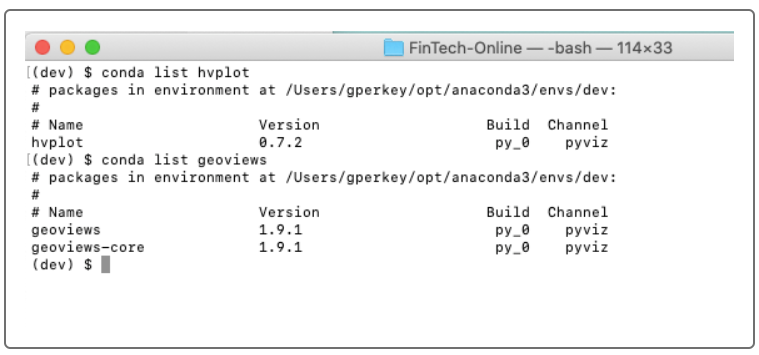

# San_Francisco_Housing
An analysis of the housing rental market data for San Francisco. The analysis will be complete with professionally styled and formatted interactive visualizations.

---

## Technologies

This project leverages python 3.7 with the following packages:

**[Pandas Library](https://pandas.pydata.org/)** - For making financial statistical calculations and plotting with hvplot<br>
**[hvPlot Library](https://hvplot.holoviz.org/)** - Works with Pandas to plot our data. Contains the GeoViews dependency that allows us to create map plots.<br>
**[pathlib Library](https://pathlib.readthedocs.io/en/pep428/)** - Allows us to read in the CSV files into our project, helping us create dataframes from those CSV files.

---

## Installation Guide

This guide will take you through setting up the tools that you need to run this application, which include:

hvPlot

GeoViews

Let’s start by installing the PyViz ecosystem, which includes both hvPlot and GeoViews.

### Install the PyViz Ecosystem

PyViz is a Python visualization package that provides a single platform for accessing multiple visualization libraries. Two of these libraries are hvPlot and GeoViews, which you’ll use to run this application.

To install PyViz and its dependencies in your Conda dev environment, complete the following steps:

From your terminal, log in to your Conda dev environment.

```python
conda activate dev
```

Install the PyViz packages by using the conda install command as follows:

```python
conda install -c pyviz hvplot geoviews
```

### Note
For some installations, you might get a message indicating that the requested packages are already installed. This is fine—Conda automatically installs the software dependencies that these libraries require.

Confirm the installation of all the PyViz packages by running the following commands:

```python
conda list hvplot
conda list geoviews
```

The following image shows the responses, which list the installed packages.




