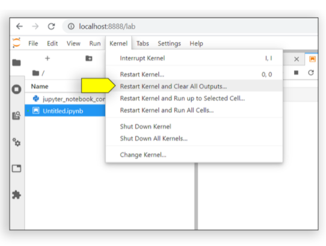
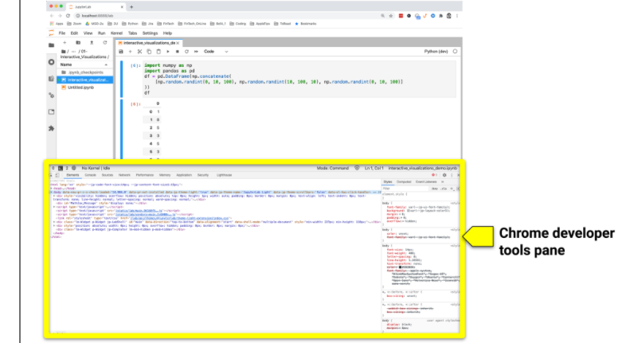
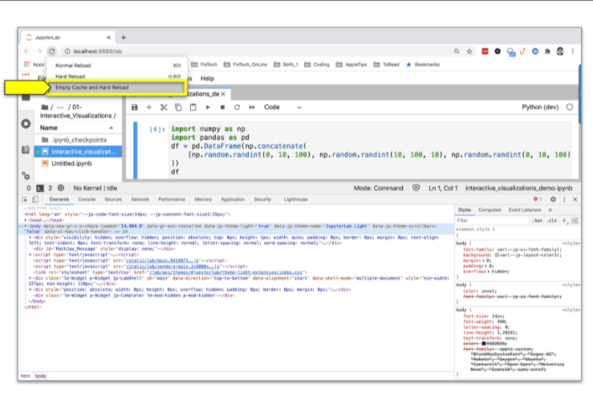
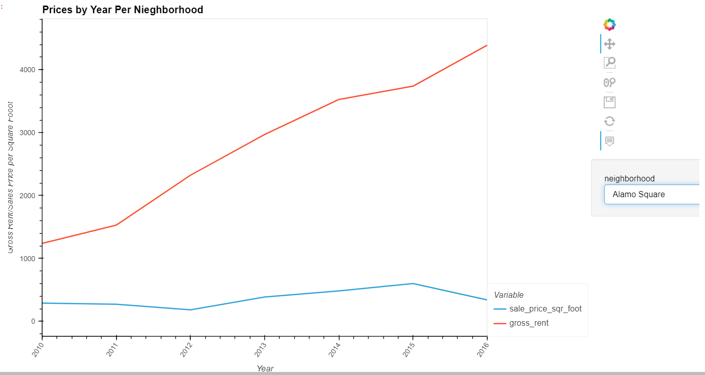
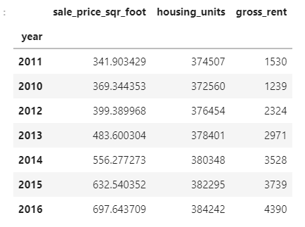

# San_Francisco_Housing
An analysis of the housing rental market data for San Francisco. The analysis will be complete with professionally styled and formatted interactive visualizations.

---

## Technologies

This project leverages python 3.7 with the following packages:

**[Pandas Library](https://pandas.pydata.org/)** - For making financial statistical calculations and plotting with hvplot<br>
**[hvPlot Library](https://hvplot.holoviz.org/)** - Works with Pandas to plot our data. Contains the GeoViews dependency that allows us to create map plots.<br>
**[pathlib Library](https://pathlib.readthedocs.io/en/pep428/)** - Allows us to read in the CSV files into our project, helping us create dataframes from those CSV files.

---

## Installation Guide

This guide will take you through setting up the tools that you need to run this application, which include:

hvPlot

GeoViews

Let’s start by installing the PyViz ecosystem, which includes both hvPlot and GeoViews.

### Install the PyViz Ecosystem

PyViz is a Python visualization package that provides a single platform for accessing multiple visualization libraries. Two of these libraries are hvPlot and GeoViews, which you’ll use to run this application.

To install PyViz and its dependencies in your Conda dev environment, complete the following steps:

From your terminal, log in to your Conda dev environment.

```python
conda activate dev
```

Install the PyViz packages by using the conda install command as follows:

```python
conda install -c pyviz hvplot geoviews
```

### Note
For some installations, you might get a message indicating that the requested packages are already installed. This is fine—Conda automatically installs the software dependencies that these libraries require.

Confirm the installation of all the PyViz packages by running the following commands:

```python
conda list hvplot
conda list geoviews
```

The following image shows the responses, which list the installed packages.


### IMPORTANT

Make sure to use hvPlot version 0.7.0 or later.

### Troubleshooting Guide for Blank Plots

Rendering visualizations in hvPlot can occasionally be troublesome. If your plot doesn’t render in your JupyterLab preview, try the processes in each of the following sections to help you resolve the issue.

### Clear the Cache that’s Associated with the Notebook Kernel

In your Jupyter notebook, on the Kernel menu, click “Restart Kernel and Clear All Outputs,” as the following image shows:



This clears all the existing cell outputs and automatically reruns the notebook from the first cell down.

### Clear the Cache from the Chrome Browser

If you’re using Google Chrome to host JupyterLab, complete the following steps:

In the Chrome browser window, press Option+Command+I (for macOS users) or Ctrl+Shift+I (for Windows users). The developer tools pane opens, as the following image shows:



With the Chrome developer tools pane open on the JupyterLab page, click and hold the browser reload button. This forces a dropdown menu to appear. On this menu, click “Empty Cache and Hard Reload,” as the following image shows:



If clearing both the kernel and the Chrome browser cache doesn’t work, proceed to the instructions in the next section.

### Recreate Your Conda Environment

If your plots still don’t properly render after clearing both your kernel and Chrome browser caches, the next step is to recreate your Conda dev environment. To do so, complete the following steps:

Quit any running applications, such as JupyterLab. Then deactivate your current Conda dev environment by running the following command:

```python
conda deactivate
```

Update the Conda dev environment by running the following command:

```python
conda update conda
```

Create a new Conda dev environment to use with PyViz by running the following command:

```python
conda create -n dev python=3.7 anaconda
```

Activate the new environment with the following command:

```python
conda activate dev
```

Install PyViz again by following the steps in the “Install the PyViz Ecosystem”.

---

## Usage

To use the San Francisco HOusing application simply clone the repository and run the **san_francisco_housing.ipynb** file with:

```python
python san_francisco_housing.ipynb
```

The application will provide 4 important pieces of information that we can use to make our recommendations.

First, we are going to generate an overlay line plot that helps us visualize the trend in the San Francisco housing market, in terms of prices per square foot vs the gross rent those properties generate. The point is to see which properties will have lower costs for our company to buy, and then rent for higher prices. We are trying to analyze which neighborhoods to focus on, and avoid, in order to generate the highest margins (profits).



Next, we will generate two dataframes that are sorted by price per square foot and gross rent. This will let us know which neighborhoods have lower sales prices per square foot, but command higher rent per month.

Sales Price Per Square Foot


